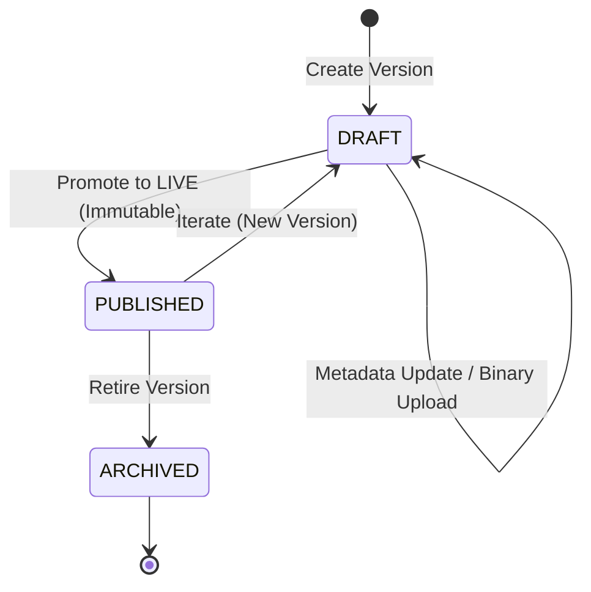
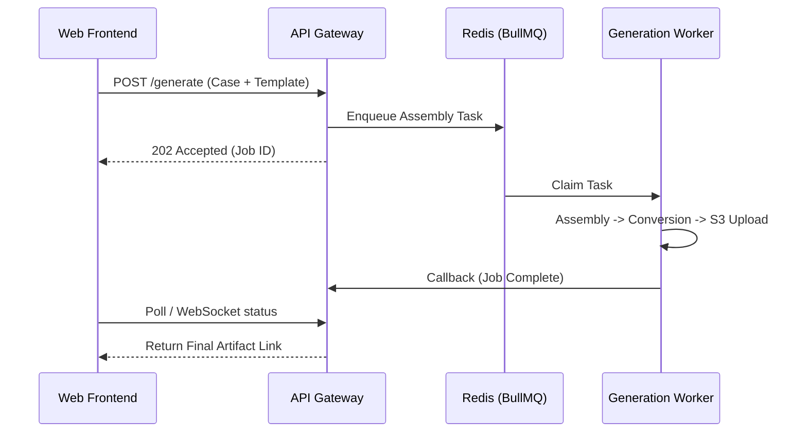

# System Architecture - Cassatix

Cassatix is a distributed legal automation platform built for scalability and reliability. It decouples user interactions from intensive document processing using a message-oriented architecture.

---

## 🏛 System Modules

The platform is composed of several independent services and data stores:

### 1. API Gateway (`apps/api`)
- **Technology**: NestJS (Node.js).
- **Responsibility**: Business logic, Role-Based Access Control, metadata persistence, and job orchestration.
- **Entry Point**: Serves the REST API to the Web frontend.

### 2. Background Worker (`apps/worker`)
- **Technology**: Node.js + BullMQ.
- **Responsibility**: Intensive CPU tasks including `.docx` assembly with XML injection and PDF conversion.
- **Isolation**: Operates independently of the API to prevent blocking the user interface during heavy generation loads.

### 3. Frontend Web (`apps/web`)
- **Technology**: React 19 + Vite.
- **Responsibility**: Responsive user interface for template management and document requesting.

### 4. Infrastructure Layer
- **PostgreSQL**: Relational storage for template schemas, version history, and audit logs.
- **Redis**: The message broker used by BullMQ to manage the generation queue.
- **S3 Storage**: Canonical home for all binary artifacts (DOCX/PDF).

---

## 🔄 Core System Lifecycles

### 1. Template Content Lifecycle
Templates move through a strict state machine to prevent draft content from reaching client documents.

### 2. Async Document Orchestration
Document assembly is handled asynchronously to ensure a responsive UI, even during large PDF conversions.

---

## 🔒 Security & Roles
Access is governed by a hierarchical role model (Admin, Lawyer, Partner) implemented at the API level via NestJS Guards.

---

## 🔗 Related Documentation
- [Data Model](./data-model.md)
- [API Overview](./api-overview.md)
- [Known Issues](./known-issues.md)
- [Back to README](../README.md)
