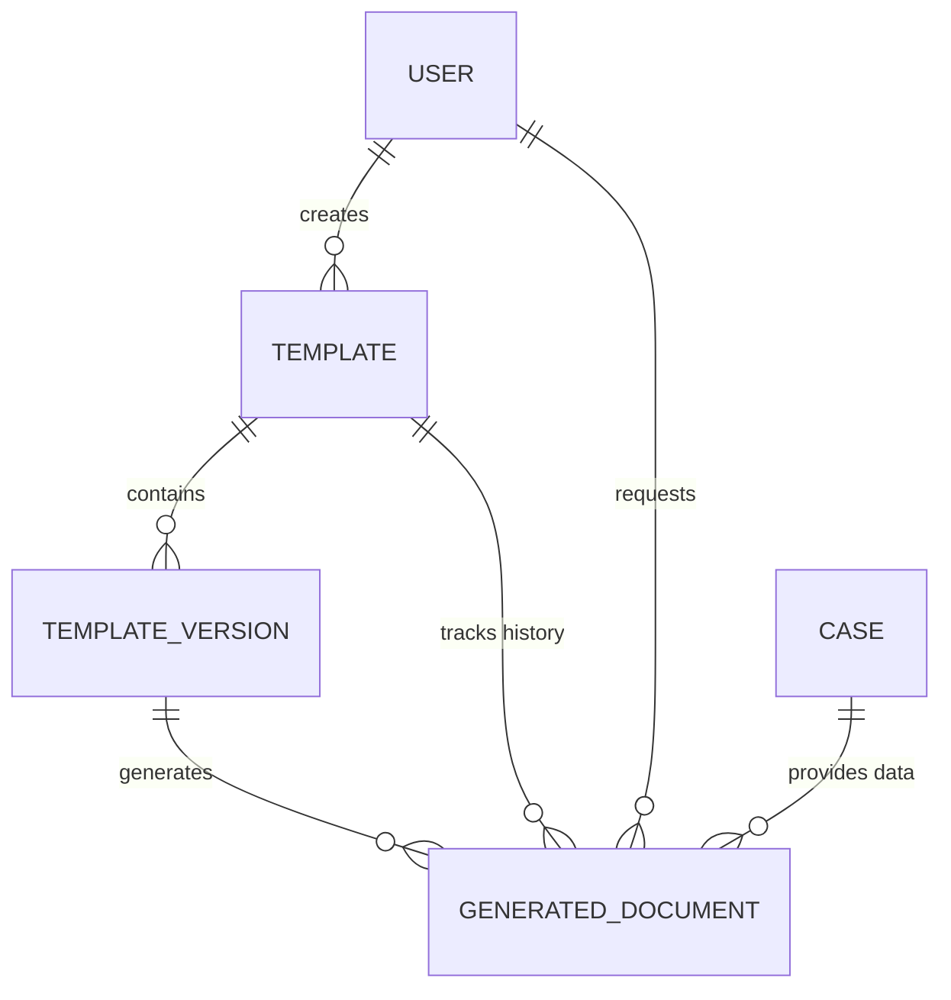

# Data Model - Cassatix

Cassatix uses a relational data model managed via Prisma ORM to track legal instruments, their versions, and the history of generated documents.

---

## 🗺 Core Entities

### 1. Template
The high-level definition of a legal document (e.g., "Master Service Agreement").
- **Fields**: `name`, `code`, `category`, `caseType`.
- **Relationship**: Owns many `TemplateVersions`. Has a pointer to one `publishedVersion`.

### 2. TemplateVersion
Represents a specific iteration of a template's content and logic.
- **Fields**: `versionNumber`, `status` (DRAFT, PUBLISHED, ARCHIVED), `storagePath` (S3).
- **Logic**: Version `PUBLISHED` content is strictly immutable.
- **Requirement**: Only versions in `PUBLISHED` status are available for PRODUCTION document generation.

### 3. GeneratedDocument
The record of a specific generation event.
- **Fields**: `status` (QUEUED, PROCESSING, COMPLETED, FAILED), `generationType` (PREVIEW, FINAL), `outputFormat` (DOCX, PDF).
- **Context**: Links a `TemplateVersion` to a specific `caseId` at a point in time.

### 4. AuditLog
System-wide activity tracking.
- **Fields**: `entityType`, `action` (CREATE, UPDATE, GENERATE), `actorId`.

---

## 📊 Entity Relationship Diagram

---

## 💼 Logical Boundaries

- **Internal (Cassatix)**: Owns the lifecycle of legal instruments, version immutability, and state-based generation history.
- **External (Cases)**: Contextual data (Parties, Dates, Amounts) is "Borrowed Context". Cassatix interfaces with the firm ERP/CMS via an adapter layer but does not own the master litigation record.

---

## 🔗 Related Documentation
- [Architecture Overview](./architecture.md)
- [API Overview](./api-overview.md)
- [Back to README](../README.md)
